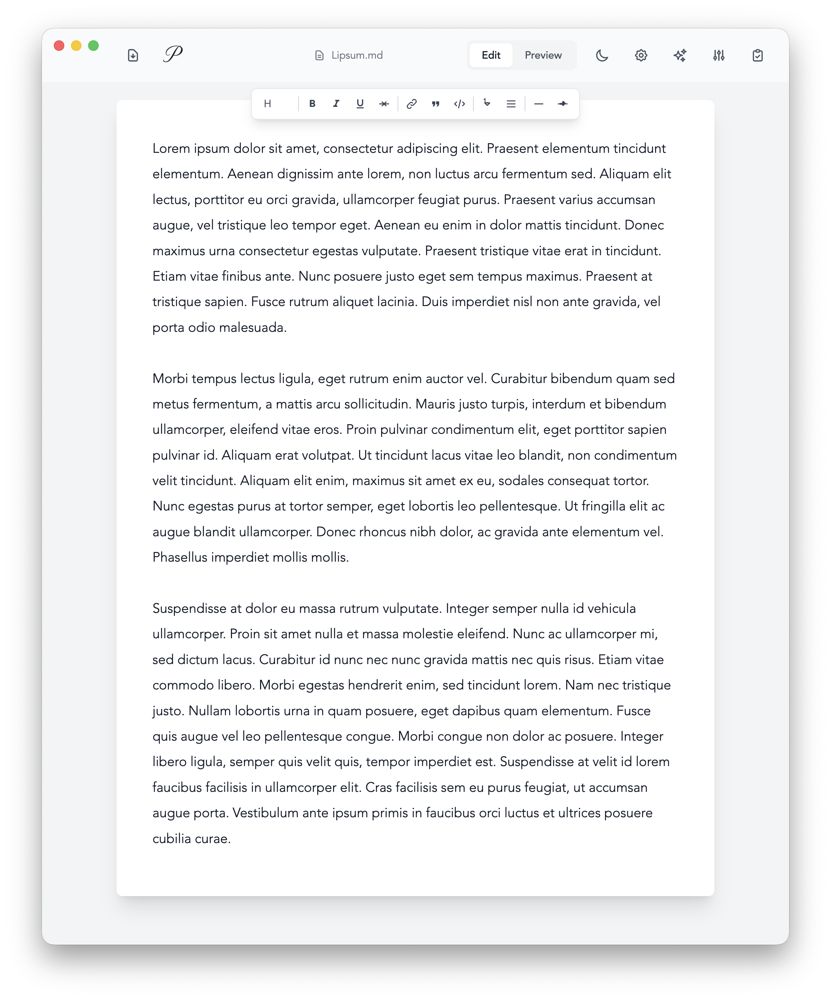

<div style="text-align: center;">
   
</div>
<br>

[](https://github.com/nathan-a-king/Prose/actions/workflows/test.yml)

A minimalist Markdown editor designed for focused writing with AI-powered assistance and real-time preview capabilities.

I live in Markdown. Every blog post, every note, every README, every chapter of my novel—it all starts as plain text with simple formatting marks. After years of this workflow, I've developed strong opinions about how a Markdown editor should work. Apparently, *very* strong opinions.

Halfway through writing my novel, I realized I was switching between editors throughout the day, each one frustrating me in different ways. One had beautiful typography but buried essential features in menus. Another handled Markdown perfectly but looked like it was designed in 2005. Some were bloated with features I'd never use, turning my simple writing environment into an interface that looked like it belonged in a NASA control center.

The more I wrote, the more these small frustrations compounded. I found myself spending more time fighting with my tools than actually writing. When you're trying to maintain flow state while crafting a narrative, even the smallest friction feels like sandpaper on your brain.

So I did what any self-respecting software engineer would do: I spent a weekend building exactly what I wanted.

<div style="text-align: center;">
   
</div>

**Prose** is a lightweight React app built for writers who love Markdown. It's not trying to be everything to everyone. It's trying to be one thing exceptionally well: a clean, fast, distraction-free environment for writing in Markdown.

Prose embodies my personal philosophy about writing tools:

**Markdown formatting should be invisible when editing.** Formatting marks should be treated as plain text while editing. Visual simplicity is one of my favorite aspects of writing in plain text.

**Text presentation matters.** Good typography isn't a luxury—it's essential for long writing sessions. Your eyes should feel comfortable after hours of work, and your writing should be presented in a visually appealing style. When reading, text should always be *fully justified.*

**Lightweight doesn't mean featureless.** It means every feature earns its place. No bloat, no feature creep, just the tools you actually use while writing.

**The UI should disappear.** When you're in flow, you shouldn't notice the interface at all. It should be so intuitive that it becomes invisible.

## Who It's For

Prose is for writers who:
- Default to Markdown for everything
- Value simplicity over feature lists
- Want their tools to respect their focus
- Believe that good writing tools should inspire you to write, not distract you from it

It's the editor I wished existed when I was deep in Chapter 12, trying to maintain momentum while my current editor decided to auto-format my dialogue in ways that made me want to throw my laptop out the window.

## Features

### Core Functionality
- **Native Desktop App** - Built with Electron for macOS, Windows, and Linux
- **Clean Markdown Editor** - Distraction-free writing environment with auto-resizing text area
- **Real-time Preview** - Toggle between edit and preview modes with live Markdown rendering
- **Document Management** - Create, save, rename, and delete documents with SQLite storage
- **Auto-save** - Automatic document saving after 3 seconds of inactivity
- **Dark/Light Mode** - System-responsive theme with manual toggle
- **Rich Text Toolbar** - Quick formatting buttons for common Markdown elements
- **Drag & Drop** - Reorder documents in the sidebar with visual feedback

### Multi-Agent Editorial System
Prose features a sophisticated AI-powered editorial system with specialized agents that can assist with different stages of the writing process:

- **Brainstorm Agent** - Generate ideas, outlines, and creative directions for your writing
- **Draft Agent** - Produce initial drafts and expand on rough concepts
- **Revision Agent** - Suggest structural improvements and comprehensive revisions
- **Editor Agent** - Provide detailed editorial feedback on grammar, style, and clarity
- **Argument Strengthener** - Enhance logical flow and strengthen argumentative writing

**Agent Features:**
- **Change Proposals** - Agents generate tracked proposals that you can accept, reject, or modify
- **Promptions System** - Dynamic parameter configuration for fine-tuned agent behavior
- **Pipeline Orchestration** - Chain multiple agents together for complex editorial workflows
- **Document State Management** - Track changes, annotations, and revision history

### AI Integration
- **Multi-Agent Architecture** - Specialized agents for different writing tasks and stages
- **Change Tracking** - Review and apply AI-suggested changes with full transparency
- **Contextual Assistance** - Agents understand your document context and writing goals
- **OpenAI Integration** - Powered by advanced language models for intelligent assistance

### Technical Features
- **Self-Contained** - All data stored locally in platform-specific user directories
- **Persistent Storage** - Documents survive app updates and reinstalls
- **Responsive Design** - Optimized for desktop writing workflows
- **Syntax Highlighting** - Code blocks with highlight.js support
- **GitHub Flavored Markdown** - Full GFM support including tables, strikethrough, and more
- **macOS Integration** - Native traffic light buttons with proper header spacing
- **Comprehensive Test Suite** - Full test coverage with Vitest for reliability

## Technology Stack

- **Desktop Framework**: Electron 38 for cross-platform desktop app
- **Frontend**: React 19 with React Router v7
- **Styling**: Tailwind CSS with custom design system
- **Build Tool**: Vite with hot module replacement
- **Backend**: Express.js server with REST API (embedded in Electron)
- **Database**: Better SQLite3 for document storage
- **Markdown**: react-markdown with remark-gfm and rehype-highlight, plus marked for parsing
- **AI**: Multi-agent system powered by OpenAI with orchestration layer
- **Testing**: Vitest with React Testing Library, happy-dom, and comprehensive test coverage
- **Validation**: Zod for runtime type checking and schema validation
- **Syntax Highlighting**: highlight.js for code block rendering

## Getting Started

### Prerequisites
- Node.js 18+ 
- npm or yarn

### Installation

1. **Clone the repository**
   ```bash
   git clone https://github.com/nathan-a-king/Prose.git
   cd Prose
   ```

2. **Install dependencies**
   ```bash
   npm install
   ```

3. **Set up environment variables (optional)**
   ```bash
   # Create .env file for OpenAI integration
   VITE_OPENAI_API_KEY=your_openai_api_key_here
   ```
   *Note: If not provided, the app will prompt for the API key when using AI features*

### Running the Application

#### Development Mode

**Option 1: Combined (Recommended)**
```bash
# Starts both Vite dev server and Electron automatically
npm run app
```

**Option 2: Manual**
```bash
# Terminal 1: Start Vite dev server
npm run dev

# Terminal 2: Start Electron in dev mode
npm run electron:dev
```

#### Production Build
```bash
# Build for all platforms
npm run dist

# Build for specific platform
npm run dist:mac     # macOS
npm run dist:win     # Windows
npm run dist:linux   # Linux
```

## Development Commands

| Command | Description |
|---------|-------------|
| `npm run dev` | Start Vite development server with hot reload |
| `npm run build` | Create optimized production build |
| `npm run preview` | Preview production build locally |
| `npm start` | Run Express production server (standalone) |
| `npm run app` | Run both Vite dev server and Electron in dev mode (recommended) |
| `npm run electron` | Run Electron app in production mode |
| `npm run electron:dev` | Run Electron app in development mode |
| `npm run electron:build` | Build and package Electron app |
| `npm run dist` | Build for all platforms |
| `npm run dist:mac` | Build for macOS |
| `npm run dist:win` | Build for Windows |
| `npm run dist:linux` | Build for Linux |
| `npm test` | Run test suite in watch mode |
| `npm run test:ui` | Run test suite with interactive UI |
| `npm run test:run` | Run test suite once (CI mode) |
| `npm run test:coverage` | Run tests with coverage report |

## Architecture

### Frontend Structure
```
src/
├── agents/                        # AI Agent Contracts
│   ├── index.js                   # Agent system initialization
│   ├── brainstormAgent.js         # Brainstorming and ideation agent
│   ├── draftAgent.js              # Initial draft generation agent
│   ├── revisionAgent.js           # Structural revision agent
│   ├── editorAgent.js             # Editorial feedback agent
│   └── argumentStrengthenerAgent.js # Argument enhancement agent
├── components/
│   ├── agents/                    # Agent UI Components
│   │   ├── AgentPanel.jsx         # Main agent interface panel
│   │   ├── ChangeProposalPanel.jsx # Change review and approval UI
│   │   ├── PromptionsControlPanel.jsx # Agent parameter configuration
│   │   ├── PromptionsOptionsRenderer.jsx # Promptions option renderer
│   │   └── SteerControlBar.jsx    # Agent steering controls
│   ├── layout/Layout.jsx          # Main layout wrapper
│   ├── settings/SettingsPanel.jsx # Application settings
│   ├── ui/ThemeToggle.jsx         # Dark/light mode toggle
│   ├── MarkdownEditor.jsx         # Markdown editing component
│   ├── MarkdownPreview.jsx        # Live preview component
│   └── SyntaxHighlighter.jsx      # Code syntax highlighting
├── contexts/
│   ├── AgentContext.jsx           # Multi-agent system state
│   └── ThemeContext.jsx           # Theme state management
├── lib/
│   └── promptions/basicOptions.js # Promptions configuration options
├── pages/
│   └── HomePage.jsx               # Main editor interface
├── services/
│   ├── agents/                    # Agent Services
│   │   ├── agentRegistry.js       # Agent registration and lookup
│   │   ├── documentState.js       # Document state and change tracking
│   │   ├── orchestrator.js        # Pipeline orchestration
│   │   └── aiService.js           # AI API integration
│   ├── promptions/PromptionsService.js # Promptions management
│   ├── documentApi.js             # Document CRUD API client
│   └── fileSystemApi.js           # File system operations
├── test/                          # Test Infrastructure
│   ├── factories/                 # Test data factories
│   ├── mocks/                     # API mocks
│   ├── utils/                     # Test utilities
│   └── setup.js                   # Test configuration
├── utils/
│   └── highlightConfig.js         # Syntax highlighting config
├── App.jsx                        # Root component with routing
└── main.jsx                       # Application entry point
```

### Backend Structure
```
├── electron.js                    # Electron main process
├── server.js                      # Express server with API routes
├── database.js                    # SQLite database setup and operations
└── build/                         # Production build output
```

### Data Storage

Prose stores all user data in a platform-specific application data directory:

- **macOS**: `~/Library/Application Support/Prose/documents.db`
- **Windows**: `%APPDATA%/Prose/documents.db`
- **Linux**: `~/.config/Prose/documents.db`

This ensures that:
- Documents persist across app updates
- Data follows OS conventions for user files
- Backups can be made by copying the database file
- Multiple users on the same machine have separate document storage

### Key Features Implementation

- **Electron Integration**: Native desktop app with embedded Express server
- **Document Management**: SQLite database stored in user data directory
- **Real-time Autosave**: React useEffect with debounced saving
- **Multi-Agent System**: Specialized AI agents coordinated through orchestration layer
  - **Agent Registry**: Dynamic registration and lookup of editorial agents
  - **Document State**: Immutable state management with change tracking
  - **Pipeline Orchestration**: Chain multiple agents in sequential workflows
  - **Change Proposals**: Track and review AI-suggested modifications
  - **Promptions**: Dynamic parameter system for agent behavior control
- **AI Integration**: OpenAI-powered agents with context-aware suggestions
- **Markdown Rendering**: ReactMarkdown with custom components for styling
- **Theme System**: React Context with localStorage persistence
- **macOS Traffic Lights**: Custom header layout accommodating native window controls
- **Drag & Drop**: Reorderable document list with visual feedback
- **Testing Infrastructure**: Comprehensive Vitest suite with factories and mocks

## API Endpoints

| Method | Endpoint | Description |
|--------|----------|-------------|
| `GET` | `/api/documents` | Get all documents |
| `GET` | `/api/documents/:id` | Get specific document |
| `POST` | `/api/documents` | Create new document |
| `PUT` | `/api/documents/:id` | Update document |
| `DELETE` | `/api/documents/:id` | Delete document |
| `PUT` | `/api/documents/:id/order` | Update document display order |

### Document Ordering

The document ordering endpoint allows you to reorder documents in the sidebar:

**Endpoint:** `PUT /api/documents/:id/order`

**Request Body:**
```json
{
  "order": 2
}
```

**Response:**
```json
{
  "success": true,
  "document": {
    "id": 1,
    "name": "My Document",
    "content": "...",
    "display_order": 2,
    "created_at": "2025-01-09T10:00:00Z",
    "updated_at": "2025-01-09T10:30:00Z"
  }
}
```

Documents are automatically reordered when one is moved, maintaining sequential order numbers. Documents with lower `display_order` values appear first in the list.

## Configuration

### Vite Configuration
- Development server on port 3000
- API proxy to backend on port 8080
- Optimized builds with vendor/router code splitting

### Tailwind Customization
- Custom color palette (primary blue shades)
- Avenir/Avenir Next font stack for body text
- JetBrains Mono for code blocks
- Custom animations (fade-in, slide-up, spin-gpu)
- Dark mode via class strategy

## AI Features Setup

The AI features require an OpenAI API key. You can provide it in three ways:

1. **Environment Variable** (recommended)
   ```bash
   VITE_OPENAI_API_KEY=your_key_here
   ```

2. **Runtime Prompt** - The app will ask for your key when first using AI features

3. **localStorage** - Your key is saved locally after first use for convenience

### Using the Multi-Agent System

Prose's editorial agents can help improve your writing at different stages:

1. **Select an Agent** - Choose from brainstorm, draft, revision, editor, or argument strengthener based on your needs
2. **Configure Promptions** - Adjust agent behavior with dynamic parameters (tone, detail level, focus areas)
3. **Run the Agent** - Execute the agent on your current document or selection
4. **Review Proposals** - View suggested changes in the Change Proposal panel
5. **Apply Changes** - Accept, reject, or modify proposals before applying them
6. **Create Pipelines** - Chain multiple agents together for complex workflows

**Promptions System:**
The Promptions system allows fine-grained control over agent behavior:
- Dynamic parameter configuration for each agent
- Persistent settings across sessions
- Context-aware suggestions based on document state
- Custom promption definitions for specialized use cases

## Contributing

1. Fork the repository
2. Create a feature branch (`git checkout -b feature/amazing-feature`)
3. Commit your changes (`git commit -m 'Add amazing feature'`)
4. Push to the branch (`git push origin feature/amazing-feature`)
5. Open a Pull Request

## License

This project is licensed under the MIT License - see the [LICENSE](LICENSE) file for details.

## Acknowledgments

- Built with React 19 and modern web technologies
- Desktop platform powered by Electron 38
- Markdown rendering powered by react-markdown and marked
- Code highlighting by highlight.js
- Multi-agent AI system powered by OpenAI
- Testing infrastructure with Vitest and React Testing Library
- Styled with Tailwind CSS custom design system
- Type validation with Zod

> Prose is dedicated to my father, Philip King, who recently passed away unexpectedly. I created Prose to keep myself occupied while grieving. I love you, dad.